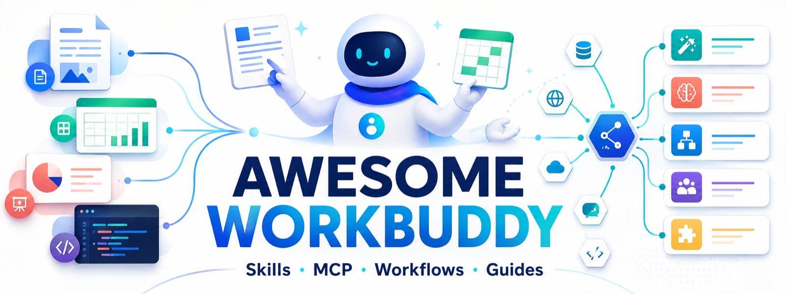

# Awesome WorkBuddy

English · [简体中文](README.md)

  

> A curated, verifiable collection of Tencent WorkBuddy learning resources, Skills, MCP integrations, and real-world workflows.

New to WorkBuddy? Begin with the [one-minute chooser and quick start](START_HERE.md), or use the [searchable resource directory](https://sandbaseai.github.io/awesome-workbuddy/) to filter by keyword and category.

For a compact machine-readable overview, see [`site/llms.txt`](site/llms.txt).

WorkBuddy is Tencent's AI Agent workspace for planning and carrying out research, document, data, design, and development tasks with natural language. This list starts with official documentation and then highlights community resources that offer reproducible steps, open source, or distinct practical value.

> [!IMPORTANT]
> This is an independent community index, not a Tencent publication. Before installing any third-party Skill, MCP server, connector, or enhancement, inspect its source, permissions, and data flow. Never upload secrets, personal data, or unredacted company material without an appropriate review.

## Contents

- [Start Here](#start-here)
- [Official Resources](#official-resources)
- [Open-source Ecosystem](#open-source-ecosystem)
- [Skills, Prompts, and MCP](#skills-prompts-and-mcp)
- [Guides](#guides)
- [Use Cases](#use-cases)
- [Research and Engineering](#research-and-engineering)
- [Related Lists](#related-lists)
- [Selection Standard](#selection-standard)
- [Contributing](#contributing)
- [Acknowledgements](#acknowledgements)

## Start Here

- [Product homepage](https://www.workbuddy.ai/) - Product overview, downloads, and plan information.
- [Official documentation](https://www.workbuddy.ai/docs/zh/workbuddy/) - The authoritative documentation hub.
- [Quick start](https://www.workbuddy.ai/docs/zh/workbuddy/Quickstart) - From installation to a first completed task.
- [Changelog](https://www.workbuddy.ai/docs/zh/workbuddy/Changelog) - Product capabilities, fixes, and compatibility changes.
- [Automation guide](https://www.workbuddy.ai/docs/workbuddy/From-Beginner-to-Expert-Guide/Function-Description/Automation-Guide) - Create one-time or recurring tasks and send results to connected platforms.
- [MCP guide](https://www.workbuddy.ai/docs/zh/workbuddy/From-Beginner-to-Expert-Guide/Function-Description/MCP-Guide) - Connect external tools and data through visual configuration.
- [WorkBuddy Enterprise quick start](https://cloud.tencent.com/document/product/1831/134527) - Create, test, publish, and connect an enterprise Agent to messaging channels.

## Official Resources

### Core concepts

- [Task bar and Skills](https://www.workbuddy.ai/docs/zh/workbuddy/From-Beginner-to-Expert-Guide/Function-Description/Task-Bar) - Learn where to find, import, and create Skills.
- [Create a Skill](https://www.workbuddy.ai/docs/zh/workbuddy/From-Beginner-to-Expert-Guide/Practice-Cases/Create-Skills) - Turn a natural-language workflow into a reusable Skill.
- [From model to harness](https://mp.weixin.qq.com/s/X_kaKcXH2uELcemaNaZ4iQ) - An architectural introduction to the WorkBuddy Agent product.

### Community channels

- [WorkBuddy product page](https://cloud.tencent.com/product/workbuddy) - Tencent Cloud's product information and updates.
- [Tencent Cloud developer articles](https://cloud.tencent.com/developer/search/article-WorkBuddy) - Searchable community engineering articles.

## Open-source Ecosystem

> [!NOTE]
> “Works with WorkBuddy” does not mean “endorsed by Tencent.” Projects are selected for direct relevance, documentation quality, maintenance, and community adoption. Check licenses, account terms, permissions, and credentials before using unofficial automation or API tooling.

### Learning and reference

- [WorkBuddyGuide](https://github.com/AlephAITech/WorkBuddyGuide) - An open practical handbook covering tutorials, workflows, Skills, MCP, automation, and multi-agent patterns.
- [Agent Learning Guide](https://github.com/tangshiyegit/agent-guide) - A MIT-licensed guide with 19 WorkBuddy tutorials and 12 office, content, and automation case studies; verify changing third-party product details against official sources.
- [AI Coding Guide Zh](https://github.com/KimYx0207/AI-Coding-Guide-Zh) - A Chinese learning path for AI coding tools and office Agents, including WorkBuddy.
- [learn-workbuddy](https://github.com/adongwanai/learn-workbuddy) - A 24-chapter Python tutorial that builds a WorkBuddy-style desktop Agent from scratch.
- [WorkBuddy Harness Bluebook](https://github.com/zjp1997720/zhijian-ai-bluebook-workbuddy-harness) - Explains prompts, memory, plugins, experts, Skills, and safety boundaries.

### Skill collections

- [WorkBuddy Skill Hub](https://github.com/sandbaseai/workbuddy-skill) - A searchable catalog of 10,000 public Skill paths with provenance, license, security, and compatibility review fields.
- [WorkBuddy Guide Skill](https://github.com/Neo5093/workbuddy-guide) - An installable Chinese reference covering connectors, Experts, automations, memory, quick cards, and troubleshooting; its optional diagnostic script reads local WorkBuddy configuration metadata and log excerpts, so redact output before sharing.
- [workbuddyskills](https://github.com/infometa/workbuddyskills) - An offline archive of WorkBuddy Skills, connectors, and experts.
- [Website Prompts and Skills](https://github.com/TencentEdgeOne/awesome-website-prompts-and-skills) - Website-generation prompts, Skills, and challenge entries maintained by Tencent EdgeOne.
- [Ray Skills](https://github.com/imraywang/rayskills) - Executable, verifiable, and recoverable workflows for content production and publishing.
- [WorkBuddy Skills](https://github.com/bitcjm/workbuddy-skills) - Skills for writing, programming, office work, and general utilities.
- [Zotero MCP WorkBuddy Guide](https://github.com/maciechen/zotero-mcp-workbuddy-guide) - A Chinese guide to connecting a local Zotero library to WorkBuddy.

### Ready-to-use Skills

This repository maintains three original installable Skills: [Document Quality Review](skills/document-quality-review/SKILL.md) performs read-only delivery checks, [Skill Security Audit](skills/skill-security-audit/SKILL.md) reviews third-party extensions before installation, and [Source-backed Research Brief](skills/source-backed-research-brief/SKILL.md) turns web research into a verifiable brief with facts and inference kept distinct.

- [WorkBuddy Guide](https://github.com/Neo5093/workbuddy-guide) - An installable WorkBuddy usage and troubleshooting Skill covering connectors, experts, automations, memory, interaction modes, and FAQs; MIT licensed. Its optional diagnostic script reads local `~/.workbuddy` configuration and recent logs and probes a localhost health endpoint, so inspect and redact output before sharing it.
- [E-commerce Visual Copywriting](https://github.com/feichanggege/ecommerce-visual-copywriting-skill) - A repeatable workflow for product analysis, copywriting, and commerce imagery.
- [Image Story Video Wizard](https://github.com/aaronyi97/image-story-video-wizard) - An audio-first story-video Skill for WorkBuddy and Codex with approval gates at consequential steps.
- [Social Account Doctor](https://github.com/JuneYaooo/social-account-doctor) - Diagnoses accounts and high-performing posts across major Chinese content platforms.
- [Bruce Draw.io](https://github.com/bruc3van/bruce-drawio) - Generates, validates, and exports draw.io diagrams across platforms.
- [Textbook Writer Skills](https://github.com/cabbage2000-lab/textbook-writer-skills) - Plans, writes, and reviews textbooks using Understanding by Design.
- [OfferLoop](https://github.com/riwonswain-ovo/OfferLoop) - An open job-search system built from seven Skills and a Feishu workspace.
- [WorkBuddy WeChat Publisher](https://github.com/cnproduct/workbuddy-wechat-publisher) - Produces copy, images, layout, and WeChat Official Account drafts.
- [CordysCRM Skills](https://github.com/1Panel-dev/CordysCRM-skills) - Agent Skills covering a CRM lead-to-cash workflow.
- [Self-media Compliance Review](https://github.com/JuneYaooo/self-media-compliance-review) - Reviews videos, covers, subtitles, sales claims, and platform risks before publishing.
- [Ontology-driven Development](https://github.com/sharptoolbox/ontology-driven-dev) - A traceable workflow from requirements and ontology modeling to application delivery.
- [Codebase Reverse](https://github.com/sharptoolbox/codebase-reverse) - Reconstructs functional, architectural, API, and data-model documentation from Java services.
- [Trade Pipeline](https://github.com/Dangooy/trade-pipeline-skill) - Generates quotations, pro forma invoices, commercial invoices, and packing lists from one order record.
- [Local Markdown Memory](https://github.com/asen-goat-mine/boujoy-local-markdown-memory) - A local-first, auditable long-term Markdown memory template for WorkBuddy and Codex.
- [WorkBuddy App Builder Skill](https://github.com/sharptoolbox/WorkBuddy-AppBuilderSkill) - An ontology-driven Skill for requirements discovery, human checkpoints, and local SQLite/API domain-app generation; review generated code and local API permissions before installation.
- [ZhiGui Second Brain Skill](https://github.com/CarlWangChina/zhigui-openclaw-ui-second-brain-skill) - A local MCP-backed planning and knowledge-graph workspace for WorkBuddy; it uses PolyForm Noncommercial 1.0.0 and reads/writes personal planning data, so review the license and permissions first.

### Tools and integrations

- [WorkBuddy Remote](https://github.com/vergess3/workbuddy-remote) - Access a WorkBuddy instance from another device.
- [Skill Buddy](https://github.com/konnga/skill-buddy) - Manage, install, and synchronize Skills and MCP servers across AI Agents.
- [WorkBuddy for Obsidian](https://github.com/bigbay957-sudo/workbuddy-for-obsidian) - Use local WorkBuddy inside Obsidian with references, edits, and provenance.
- [Tencent Meeting CLI](https://github.com/TencentCloud/tencentmeeting-cli) - Tencent's official CLI for meeting management and Agent integration.
- [Devnors Data MCP](https://github.com/DevnorsAI/devnors-data-mcp) - Legal, company, content, and research data APIs for WorkBuddy; requires an external API key.
- [Agent Context Sync](https://github.com/westsource/agentctxsync) - Self-hosted session synchronization and backup across devices and Agents.

### Community clients and enhancements

- [WorkBuddy Auto Sign-in](https://github.com/88lin/workbuddy-auto-signin) - Dependency-free check-in and reward automation; it reads a local session token and uses reverse-engineered unofficial endpoints, so review the source and account terms first.
- [WorkDaddy](https://github.com/babygoton/WorkDaddy) - A desktop enhancement for backups, session migration, and long-running task support.
- [WorkBuddy Skin Studio](https://github.com/cdredfox/workbuddy-skin-studio) - A reversible theme manager for WorkBuddy Desktop.
- [OpenWorkBuddy](https://github.com/CatCatUncle/openworkbuddy) - A local, WorkBuddy-style AI office workspace.
- [LinkCode](https://github.com/arcboxlabs/linkcode) - An open desktop client supporting multiple coding Agents.
- [CodeDrobe Desktop](https://github.com/CodeDrobe/desktop) - An open-source, reversible theme manager for WorkBuddy and other AI desktop apps; review account, app-path, and download permissions before use.
- [WorkBuddy Switch](https://github.com/changexbc/workbuddy-switch) - A cross-platform WorkBuddy/CodeBuddy account switcher with usage visibility; it stores OAuth tokens, rewrites local auth files, and calls unofficial endpoints, so review the source and account terms first.

### Benchmarks

- [workbuddy-bench](https://github.com/Tencent/workbuddy-bench) - Tencent's multi-domain coding-agent benchmark, tasks, and evaluation code.

See the automatically refreshed [ecosystem activity and star ranking](ECOSYSTEM.md).

## Skills, Prompts, and MCP

### Build and use Skills

- [Build a document review Skill](https://mp.weixin.qq.com/s/oFjSrlTp5VlMzPwN_iPOjg) - A complete document-review example.
- [WorkBuddy + Kingsoft Docs Skill](https://mp.weixin.qq.com/s/t2XuzNFmTWYBYMLhn762eQ) - Organize WeRead notes in Kingsoft Docs.
- [Eight prompts for internet teams](https://mp.weixin.qq.com/s/E1liM7qHAa-EbzVnmzYClA) - Prompt examples for product and operations work.

### Connect tools with MCP

- [Use an MCP server in WorkBuddy](https://developer.cloud.tencent.com/article/2698011) - MCP configuration and invocation tutorial.
- [WorkBuddy + Agent Mail](https://mp.weixin.qq.com/s/4sEZdOlEptsqbwmWSUplVQ) - An automated email-processing workflow.
- [WorkBuddy + Qichacha MCP](https://mp.weixin.qq.com/s/NRaiAMTHL6ckR9DGxUXPZA) - A company due-diligence workflow.

## Guides

### Articles

- [Six WorkBuddy tips](https://mp.weixin.qq.com/s/Gdax9JpvDnDrolXFkuG-Pw) - Quick tips for first-time users.
- [WorkBuddy from zero to productive](https://mp.weixin.qq.com/s/JZWIB3tKNdRKRiXx-87Bpg) - A Chinese getting-started tutorial.
- [Three-month field guide](https://mp.weixin.qq.com/s/Uq8v9KIw1QJchBIouNRCkA) - Long-term usage notes and workflows.
- [WorkBuddy beginner guide](https://mp.weixin.qq.com/s/Tiw2M-j05noSOS9rLbUiWg) - A beginner guide focused on Chinese office work.

### Videos

- [Why is WorkBuddy popular?](https://www.bilibili.com/video/BV1DK7K65Ex2/) - Product positioning and capability overview.
- [WorkBuddy in 35 minutes](https://www.bilibili.com/video/BV1j1JP6oEHA/) - A complete feature demonstration.
- [From beginner to advanced](https://www.bilibili.com/video/BV1ggKf6AEVY/) - A structured video tutorial.
- [Build Agent workflows by talking](https://www.bilibili.com/video/BV1ngJH6yEKH/) - A solo-company automation case study.

## Use Cases

### Knowledge management

- [WorkBuddy + IMA knowledge loop](https://mp.weixin.qq.com/s/A1RpRA240rOwqFYb8RUJmg) - A continuously maintained personal knowledge base.
- [WorkBuddy + Obsidian](https://mp.weixin.qq.com/s/VlcgqGtKt6OpESkvfBG0Zw) - Local notes and Agent collaboration.
- [CFA knowledge base](https://mp.weixin.qq.com/s/B-S2cXBtSFk15QwyOeK7iQ) - Retrieval over large professional textbooks.

### Documents, data, and professional work

- [Create polished presentations](https://mp.weixin.qq.com/s/4v-aXrx3H3ndy0tobFJO2g) - Presentation generation and visual refinement.
- [Automated financial report analysis](https://mp.weixin.qq.com/s/QsiUU8aep-xDQpA4ikz_DA) - Analyze company reports in batches.
- [Build a 1,000-page bid](https://mp.weixin.qq.com/s/Ll6oP5J0rWhEmZ2pXdJOvw) - A long-document processing case study.
- [Commercial lawyer starter guide](https://mp.weixin.qq.com/s/9mvnhDRrkx_UO_yA94LwGw) - An introduction for legal work.
- [Organize local files](https://mp.weixin.qq.com/s/CmkC0VxwYjyK5MKTC-07MQ) - File classification and organization workflow.

### Education

- [Student learning analysis](https://mp.weixin.qq.com/s/KvPEcdJ2JUoH-F8R5E4Qww) - Process student learning data.
- [Ten classroom applications](https://mp.weixin.qq.com/s/7z_-x3Yk6fHkSMDd3NgqEQ) - A collection of teaching scenarios.
- [Personalized student diagnostics](https://mp.weixin.qq.com/s/mgLjBbcD-avXRiM9sxJn4w) - Generate individualized reports in batches.

### Content and career

- [AI content production pipeline](https://mp.weixin.qq.com/s/dSKr_a5lUYunDfS79oRzcA) - From topic selection through publishing.
- [Exam prep and job search](https://mp.weixin.qq.com/s/ldhLYboHnLiqrz12I5vW9Q) - Orchestrate study and job-search tasks.
- [Six time-consuming job-search tasks](https://mp.weixin.qq.com/s/mogl1CFtEEf9GCK2_BxbCg) - Practical job-search automation.

## Research and Engineering

- [Tencent WorkBuddy Bench](https://arxiv.org/abs/2607.20911) - A multi-domain coding-agent benchmark with a reproducible evaluation protocol.
- [CloudBase model configuration](https://docs.cloudbase.net/ai/ai-tools/workbuddy) - Connect an OpenAI-compatible model endpoint.

## Related Lists

- [staruhub/awesome-workbuddy](https://github.com/staruhub/awesome-workbuddy) - A Chinese-first index of Skills, prompts, tutorials, evaluations, and integrations.
- [awesome-workbuddy-skills](https://github.com/shuangying0001-beep/awesome-workbuddy-skills) - Skills for automation, data, browsers, WeChat, and content production.
- [awesome-workbuddy-use-cases](https://github.com/EvoLinkAI/awesome-workbuddy-use-cases) - A large use-case library organized by profession and task.
- [awesome-mcp-servers](https://github.com/punkpeye/awesome-mcp-servers) - A broad MCP server list; review each server separately before connecting it to WorkBuddy.

## Selection Standard

**Relevance:** A resource must directly support, explain, or evaluate Tencent WorkBuddy rather than merely mention the term.

**Verifiability:** Official sources, open code, executable steps, tests, demonstrations, and clear inputs and outputs are preferred.

**Maintenance:** Recent commits, issue activity, archival status, and link health are checked. Stars are supporting evidence, not the selection rule.

**Safety and transparency:** Licenses, scripts, dependencies, permissions, credential handling, data flow, and commercial relationships matter.

**Distinct value:** Reposts, pure promotion, duplication, and resources without substantial detail are not accepted because of popularity alone.

Use the [Skill, MCP, and extension security checklist](SECURITY.md) before installing third-party code. Unreviewed discoveries remain in the [automated discovery queue](DISCOVERIES.md) instead of entering the main list automatically.

Want to build a Skill? See this repository's [original Skills and structural validator](skills/README.md).

## Contributing

Contributions are welcome. Read [CONTRIBUTING.md](CONTRIBUTING.md) first. A strong entry:

1. is directly relevant to Tencent WorkBuddy and has a stable public link;
2. offers verifiable information, reproducible steps, or distinct practical value;
3. uses `Title - One-sentence value.` format in the most precise category; and
4. discloses payment, promotion, data collection, and high-risk permissions.

If this index saved you time, consider giving it a star. You can also [open an issue](https://github.com/sandbaseai/awesome-workbuddy/issues/new/choose) to nominate a resource you have verified. Bring questions, ideas, and open-ended conversation to [Discussions](https://github.com/sandbaseai/awesome-workbuddy/discussions), and read the [Code of Conduct](CODE_OF_CONDUCT.md) before participating.

## Acknowledgements

Initial discovery was informed by [semlinker/awesome-workbuddy](https://github.com/semlinker/awesome-workbuddy). Thanks to its maintainers and to every linked author. Copyright in linked resources remains with their respective owners.

This index is released under [CC0 1.0 Universal](LICENSE). Indexed resources retain their own licenses and terms.
